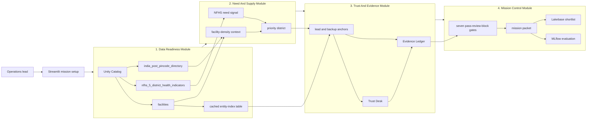

# Care Convoy

Care Convoy is a decision-support app for global-health referral planning in India. It helps an operations team compare district health need, local facility supply, facility trust signals, and source evidence before deciding where a specialty medical team should go next.

Instead of presenting a single opaque score, Care Convoy produces a saveable referral mission packet with cited evidence, uncertainty labels, duplicate and website trust checks, and a clear next action: shortlist, verify first, or hold.

The app is built for non-technical users who need a practical answer: which district should be prioritized, which facility can anchor referrals, what evidence supports that choice, and what still needs verification.

**Hackathon note:** Care Convoy was built for the Databricks Data for Good Hackathon using the provided Virtue Foundation facility dataset, NFHS district indicators, and India pincode directory.

- **Author:** Pingying Chen
- **Co-author:** Zihang Liang

## Fast Read

From here, the README is judge-facing: it maps the project to the hackathon track, demo path, evidence model, validation proof, and Databricks resources.

**Track 3: Referral Copilot for the Virtue Foundation Data for Good Hackathon**

| Judging criterion | What Care Convoy proves | Where to look in the demo |
|---|---|---|
| Product judgment | A non-technical operations lead can choose a district, referral anchor, and verification action in minutes. | Mission setup, Map + Packet, Shortlist |
| Evidence and uncertainty | Rankings, facility fit, NFHS context, trust labels, and recommendations show citations or warnings instead of hiding weak evidence. | Trust Evidence, Anchor Review, Mission Control |
| Technical execution | Runs as a Databricks App using Unity Catalog, SQL Warehouse, a cached entity-index table, Lakebase, Model Serving hooks, MLflow evaluation, Streamlit, pandas, Plotly, and PyDeck. | Live app, Validation Status, Pipeline View |
| Ambition | The app does not stop at a map or a list. It uses a seven-gate Mission Control workflow to decide whether to shortlist, verify first, or hold. | Mission Control v5.4 |

**Best judge takeaway:** Care Convoy turns messy healthcare facility data into an evidence-backed, uncertainty-aware, persistent referral decision.

## Demo Media

<table>
  <tr>
    <td width="58%">
      
    </td>
    <td width="42%">
      <h3>3-minute video placeholder</h3>
      
<strong>Status:</strong> add the final Devpost, YouTube, or Loom link here before submission.

      <ul>
        <li>0:00 - name Track 3 Referral Copilot.</li>
        <li>0:20 - build one referral plan.</li>
        <li>1:10 - show citations and uncertainty gates.</li>
        <li>2:10 - save the shortlist decision.</li>
        <li>2:40 - close with Databricks resources and validation.</li>
      </ul>
    </td>
  </tr>
</table>

## One Decision, End To End

1. Select a care mission such as maternal health, surgery, emergency care, or general access.
2. Filter by state, district, and minimum certainty when the operator wants a narrower run.
3. Click **Build Referral Plan**.
4. Review the priority district, map, referral anchor, backup anchor, confidence, warnings, and cited evidence.
5. Open **Mission Control** to see pass, review, or block gates for need, supply density, facility fit, trust, evidence, strategy, and supervisor action.
6. Open **Trust Evidence** to inspect duplicate resolution, website verification, source URLs, and weak-evidence flags.
7. Save a shortlist decision with a verification note so the recommendation becomes durable operational state.

<strong>Interactive judge walkthrough</strong>

| Beat | Question the judge can ask | What the app shows |
|---|---|---|
| Decide | "Where should the next team go?" | A ranked district and lead referral anchor, not a raw table. |
| Trust | "Can I believe this facility claim?" | Citation rows, website status, duplicate risk, source URL gaps, and confidence labels. |
| Act | "What should the operator do next?" | Shortlist, verify-first, or hold action from Mission Control, then a Lakebase-saved decision. |

## What Care Convoy Helps You Do

- **Find a practical starting point:** rank districts and candidate referral anchors for the selected care need.
- **Balance need with supply:** combine NFHS district health indicators with facility-density context instead of looking only at hospital counts.
- **Check whether an anchor is believable:** compare facility claims, website evidence, duplicate risk, and trust signals before acting.
- **See the evidence behind the recommendation:** inspect facility text, source URLs, and Unity Catalog provenance rows for important claims.
- **Know when to slow down:** use Mission Control v5.4 to turn weak evidence into a visible shortlist, verify-first, or hold action.
- **Reuse resolved facility identities:** rely on a cached entity index with source-row fingerprints, while falling back to runtime resolution when data changes.
- **Keep the decision durable:** save the mission packet, gate trace, facility anchor, confidence, decision, and review note to Lakebase.
- **Validate the workflow:** use MLflow evaluation checks for evidence grounding and operator actionability.

## Optimized Pipeline View

<strong>Module 1 - Data Readiness</strong>

- Reads the three provided Virtue Foundation Unity Catalog tables.
- Treats sparse capability fields, duplicate-looking facilities, weak source URLs, and district-name mismatch as product risks.
- Keeps the v5.4 entity-index cache as an optimization path, with source-row fingerprints to avoid stale mappings after dataset updates and runtime entity resolution as fallback.

<strong>Module 2 - Need And Supply</strong>

- Combines NFHS district health indicators with facility-density context.
- Uses mission type to choose the relevant need and capability signals.
- Outputs the priority district and uncertainty labels before selecting an anchor.

<strong>Module 3 - Trust And Evidence</strong>

- Ranks lead and backup facility anchors from the provided facilities table.
- Aligns the Trust Desk review to the selected lead facility, not an unrelated duplicate.
- Emits citation rows for facility claims and provenance rows for NFHS and density claims.

<strong>Module 4 - Mission Control And Persistence</strong>

- Runs Need Scout, Supply Mapper, Facility Scout, Trust Verifier, Evidence Auditor, Mission Strategist, and Supervisor.
- Converts the weakest required gate into the operator-facing action: shortlist, verify first, or hold.
- Saves the accepted decision and gate trace to Lakebase so the app demonstrates persistent action.

## Data Citations

Care Convoy uses the provided Virtue Foundation dataset as the primary product data source. The first three tables below are part of the Databricks hackathon dataset path `databricks_virtue_foundation_dataset_dais_2026.virtue_foundation_dataset`; the remaining rows are derived or evaluation artifacts that support the flow without replacing the provided data.

| Dataset | Role in the flow | User-facing evidence |
|---|---|---|
| `facilities` | Facility names, capabilities, locations, source URLs, social proof proxies, doctors, capacity, descriptions, anchor ranking, and Trust Desk review. | Facility citations, source URL warnings, trust labels, anchor cards. |
| `nfhs_5_district_health_indicators` | District-level health need signals such as child underweight rate, insurance coverage, institutional births, and high blood pressure prevalence. | NFHS need summary and district provenance rows. |
| `india_post_pincode_directory` | District and state reconciliation for facility-density context. | Density provenance rows and district supply warnings. |
| `workspace.default.care_convoy_facility_entity_index` | Derived cache from `facilities` for entity resolution, canonical facility names, duplicate flags, source-row fingerprints, and search-ready text. It is an optimization path, not a new source of truth. | Faster Trust Desk resolution, stale-cache fallback, duplicate-risk alignment, and grep-ready evidence text. |
| MLflow GenAI evaluation dataset | Validation-only evaluation artifact. It is not used to make product recommendations. | Evidence-grounding and operator-actionability evaluation report. |

No external population denominator, travel-time routing dataset, Spark Declarative Pipeline, or active vector-search corpus is claimed as active in the judged workflow.

## Mission Control v5.4

Mission Control prevents the app from becoming a single opaque ranking.

| Gate | What it checks | Why judges should care |
|---|---|---|
| Need Scout | NFHS need indicators and demand uncertainty. | Shows the recommendation starts from health need. |
| Supply Mapper | Facility-density pressure and district reconciliation. | Separates true shortage from weak joins. |
| Facility Scout | Lead and backup anchor fit from provided facilities. | Makes the referral plan operational. |
| Trust Verifier | Duplicate resolution, website status, and trust signal. | Avoids overtrusting messy facility rows. |
| Evidence Auditor | Lead-anchor citations and unsupported-claim downgrades. | Keeps important claims grounded. |
| Mission Strategist | Need, supply, capability, trust, and evidence trade-offs. | Converts analysis into action. |
| Supervisor | Final board verdict and confidence. | Produces the saved shortlist decision. |

## Validation Status

- Databricks App is `RUNNING`.
- Hosted UI validation saved a shortlist item and Lakebase readback confirmed the saved decision reloaded.
- Local deterministic tests passed: `50 passed`.
- Python syntax compilation passed.
- Dependency audit returned no known vulnerabilities.
- Live Databricks checks confirmed all three provided tables are populated.
- Current code path returns live NFHS plus Maharashtra facility-density rows without falling back.
- Cached entity-index table `workspace.default.care_convoy_facility_entity_index` contains `9,989` fingerprinted rows, `9,989` distinct facility IDs, and `9,960` resolved entities.
- Live v5.4 helper proof returned `district_source=live`, `facility_source=live`, `entity_index_source=cached`, `12` facility rows, `12` entities, and `6` lead-anchor citation rows.
- Lakebase readback saved note `v5.4 cached entity index readback 20260616T0635Z` after the cached helper run.
- Databricks App is running with the latest v5.4 cached entity-index configuration.
- Native MLflow GenAI evaluation ran with two registered checks and 5/5 `yes` results for evidence grounding and operator actionability.

## Latest Version

Care Convoy v5.4 is the current judge-facing build. It combines deterministic facility ordering, lead-anchor citation gating, NFHS and density provenance, trust-review alignment, Lakebase readback, native MLflow evaluation, and cached entity resolution in one stable referral workflow.

## Databricks Resources

- **App:** Databricks Apps with Streamlit.
- **Governed data:** Unity Catalog tables from the provided Virtue Foundation dataset.
- **Query path:** Databricks SQL Warehouse.
- **Persistence:** Lakebase shortlist store.
- **LLM path:** Databricks Model Serving endpoint when configured, deterministic fallback when unavailable.
- **Observability:** MLflow tracing hooks and GenAI evaluation.

## Acknowledgements

Care Convoy was built during the hackathon period with original application code. See `AGENTS.md` for local development workflow and agent/skill reference details.

## Demo Payoff

Care Convoy does not just map need or list hospitals. It turns imperfect facility and district evidence into a cautious, cited, saveable referral decision for an operations lead.
