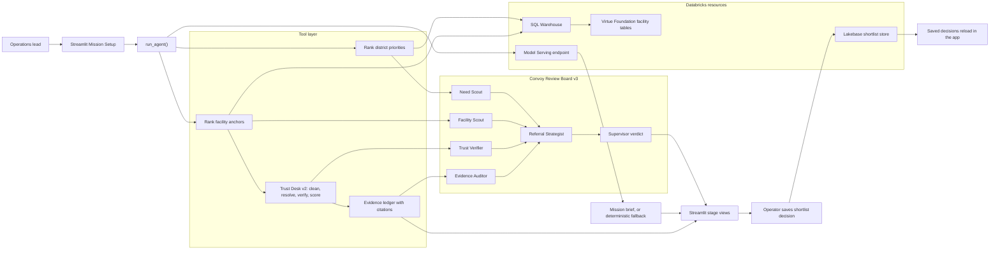

# Care Convoy

Care Convoy is a Databricks Apps submission for the Virtue Foundation Data for Good hackathon. It helps an operations lead decide where to send the next specialty medical team in India by combining district need, facility capability, evidence citations, uncertainty labels, and a multi-agent review board.

## Judge Summary

- **Track:** Referral Copilot with a trust-scoring support layer.
- **Primary user:** Virtue Foundation operations lead.
- **Decision improved:** Choose a credible district and facility anchor for the next referral or outreach team.
- **Core idea:** Do not only rank facilities; review whether the evidence is strong enough to act on.
- **Built on:** Databricks Apps, Unity Catalog, SQL Warehouse, Lakebase, Model Serving, Streamlit, pandas, and Plotly.

## Demo Path

1. Choose a care need and optional geography in the sidebar.
2. Click **Build Referral Plan**.
3. Review the recommended districts, facility anchors, uncertainty labels, and cited evidence.
4. Open **Review Board** to see the six-agent Convoy Review Board v3 decision.
5. Open **Trust Evidence** to inspect entity-resolution, website-verification, and trust-score signals.
6. Save a shortlist decision to prove the recommendation becomes persistent operational state.

## What Judges Should Look For

- **Evidence-first workflow:** Facility claims, rankings, and recommendations are paired with citation rows and warning states.
- **Uncertainty as product behavior:** Weak evidence, missing source URLs, duplicate ambiguity, and unavailable website signals downgrade confidence instead of being hidden.
- **Multi-agent decision layer:** v3 adds specialized review agents on top of the v2 trust score so a single scalar score does not drive the decision alone.
- **Persistent action:** Shortlist decisions are saved to Lakebase with board verdict, confidence, facility name, and agent metadata.
- **Databricks-native execution:** The app uses managed Databricks resources rather than a standalone local-only demo.

## Pipeline Orchestration

## Key Features

- **Referral planning:** Ranks districts and candidate facility anchors for the selected care need.
- **Trust Desk v2:** Cleans candidate rows, resolves duplicate-looking facilities, checks public website evidence, and calculates trust-supported recommendation signals.
- **Convoy Review Board v3:** Uses six specialized agents to review need, facility fit, trust signals, citation safety, referral strategy, and final supervisor approval.
- **Evidence ledger:** Shows the source text behind important claims and keeps missing citations visible.
- **Shortlist persistence:** Saves operational decisions and reloads them in the app.

## Convoy Review Board v3

- `Need Scout` checks district need and uncertainty context.
- `Facility Scout` evaluates the lead facility's capability fit and referral readiness.
- `Trust Verifier` reuses Trust Desk v2 entity resolution, website verification, and trust scoring.
- `Evidence Auditor` blocks claim-safe language when citations are missing or source URLs are blank.
- `Referral Strategist` combines need, capability, trust, and evidence into a recommended action state.
- `Supervisor` produces the final board verdict and stores board summary, verdict, confidence, and agent names in shortlist metadata.

## Version History

- `v1.0` - Built the first referral copilot MVP around district need, facility anchors, evidence, and shortlist persistence.
- `v2.0` - Added Trust Desk v2 with facility cleaning, entity resolution, public-website verification, and trust-supported referral planning.
- `v2.1` - Improved the stage-based UI, canonical entity ranking, KPI behavior, and review-required handling for missing website signals.
- `v2.2` - Reframed the app around the referral-copilot workflow and fixed layout issues that could hide post-run output.
- `v3.0` - Added Convoy Review Board v3, a six-agent decision layer that reviews district need, facility fit, Trust Desk v2 evidence, citation safety, and supervisor approval before shortlist persistence.
- `v3.1` - Hardened validation with parameterized SQL filters, guarded public-page scraping, Lakebase metadata readback, model-summary provenance, app boot coverage, and dependency audit checks.

## Validation Summary

- Local deterministic suite: `python3 -m pytest tests/ -q` returned `27 passed`.
- Syntax gate: `python3 -m compileall src` passed.
- Dependency audit: `python3 -m pip_audit -r requirements.txt` returned no known vulnerabilities.
- Browser availability check confirmed the deployed Databricks App renders the Care Convoy Streamlit UI instead of a platform error page.
- Lakebase read-after-write smoke confirmed shortlist metadata can persist and reload through the app persistence layer.

## Repository Guide

- `src/app.py` contains the Streamlit user journey and stage views.
- `src/agent/reasoning.py` orchestrates the referral plan and Review Board v3.
- `src/agent/tools.py` contains district ranking, facility ranking, trust scoring, evidence extraction, and shortlist write helpers.
- `src/db/warehouse.py` handles Databricks SQL reads.
- `src/db/lakebase.py` handles persistent shortlist storage.
- `src/connectors/search.py` handles public-search and website-signal enrichment with safety guards.
- `tests/` contains contract, security, app-render, and regression tests.
