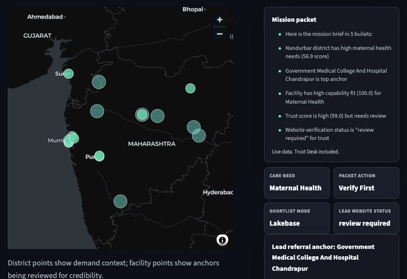
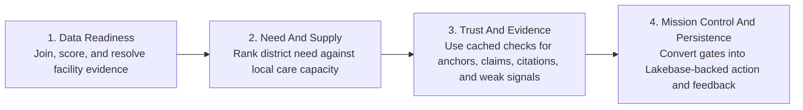
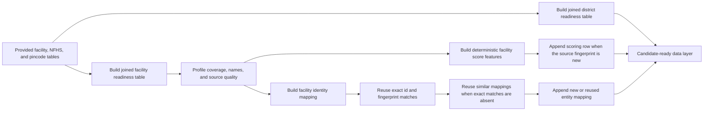
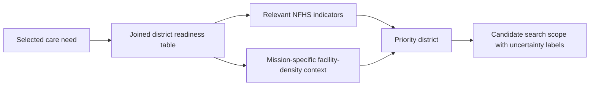
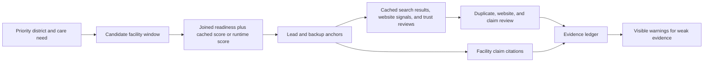
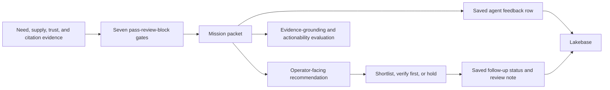

# Care Convoy

Care Convoy is a referral planning tool for India that helps health teams find where specialty care is most needed, which facility to review first, and what evidence to verify before action.

Instead of presenting a single opaque score, Care Convoy produces a reviewable referral plan with cited evidence, uncertainty labels, duplicate and website trust checks, and a clear next action: shortlist, verify first, or hold.

The demo payoff is simple: Care Convoy does not just map need or list hospitals. It turns imperfect facility and district evidence into a cautious, cited referral recommendation with a saved review note for the next follow-up step.

The current app keeps the operator-first referral workflow and improves usability: dashboard numbers appear before filters, the planner has one authoritative navigation path, user-facing labels use plain language, scores carry their scale and meaning, and infrastructure details stay out of the product flow. The latest backend prepares joined facility and district readiness tables for the app to call directly, caches expensive evidence checks outside the click path, and writes both operator decisions and agent feedback to Lakebase. A separate **Product Introduction** page explains the product, workflow, evidence model, and usability improvements without crowding the referral planner.

**Hackathon note:** Care Convoy was built for the Databricks Data for Good Hackathon using the provided Virtue Foundation facility dataset, NFHS district indicators, and India pincode directory.

- **Author:** Pingying Chen
- **Co-author:** Zihang Liang

## Fast Read

From here, the README is judge-facing: it maps the project to the hackathon track, demo path, evidence model, and Databricks resources.

**Track 3: Referral Copilot for the Virtue Foundation Data for Good Hackathon**

| Judging criterion | What Care Convoy proves | Where to look in the demo |
|---|---|---|
| Product judgment | A non-technical operations lead can choose a district, referral anchor, and verification action in minutes. | Plan, Why This Place, Save Review Note |
| Evidence and uncertainty | Rankings, facility fit, NFHS context, trust labels, and recommendations show citations or warnings instead of hiding weak evidence. | Evidence Details, Compare Anchors, Why This Place |
| Technical execution | Runs as a Databricks App using Unity Catalog, SQL Warehouse, joined readiness tables, append-only scoring and entity-mapping tables, backend evidence caches, Lakebase, Model Serving hooks, MLflow evaluation, Streamlit, pandas, Plotly, and PyDeck. | Product Introduction, Backend Pipeline, Databricks Resources |
| Ambition | The app does not stop at a map or a list. It uses seven decision gates to decide whether to shortlist, verify first, or hold. | Decision gates |

## Current Version Notes

The current build includes the v8 and v9 hardening passes.

| Version | What changed | Why it matters |
|---|---|---|
| v8 | Tightened the operator UI for a 13-inch MacBook viewport: larger readable type, filters moved into the planner before the map, less first-glance clutter, shorter score text, and clearer critical-bar emphasis. | The first screen now supports a live demo without forcing judges to parse dense dashboard copy. |
| v9 | Added app-ready joined facility and district tables, broader live-data fallback before any demo sample fallback, cached web-evidence table hooks, and Lakebase agent-feedback persistence. | The app can call prepared Databricks data directly, avoid slow runtime joins/scrapes during the demo, and prove durable state beyond browser session memory. |

## Demo Media

<table>
  <tr>
    <td width="58%">
      
    </td>
    <td width="42%">
      <h3>3-minute video placeholder</h3>
      
<strong>Status:</strong> add the final Devpost, YouTube, or Loom link here before submission.

      <ul>
        <li>0:00 - name Track 3 Referral Copilot.</li>
        <li>0:20 - show the recommended next move.</li>
        <li>1:10 - open Why This Place for the weakest gate.</li>
        <li>1:45 - open Evidence Details for plain-language source notes and uncertainty.</li>
        <li>2:20 - save a review note for the follow-up work.</li>
        <li>2:45 - open Product Introduction for the product story and usability summary.</li>
      </ul>
    </td>
  </tr>
</table>

## One Decision, End To End

1. Select a care mission such as maternal health, surgery, emergency care, or general access.
2. Review the dashboard numbers first, then filter by state, district, and minimum certainty when the operator wants a narrower run.
3. Click **Build Referral Plan**.
4. Review the priority district, map, referral anchor, backup anchor, confidence, warnings, and cited evidence. A map selection can focus the planner on the selected district or place.
5. Open **Why This Place** to see pass, review, or block gates for need, supply density, facility fit, trust, evidence, strategy, and supervisor action.
6. Open **Evidence Details** to inspect duplicate review, website verification, source URLs, and weak-evidence flags in plain language.
7. Save a review note so the recommended follow-up becomes durable operational state.
8. Open **Product Introduction** to review the product story, workflow, evidence surfaces, usability changes, and explicit non-claims.

## What Care Convoy Helps You Do

- **Find a practical starting point:** rank districts and candidate referral anchors for the selected care need.
- **Balance need with supply:** combine NFHS district health indicators with facility-density context instead of looking only at hospital counts.
- **Zoom in without losing context:** start with dashboard-wide signals, then narrow the view through filters or map selection.
- **Check whether an anchor is believable:** compare facility claims, website evidence, duplicate risk, and trust signals before acting.
- **See the evidence behind the recommendation:** inspect readable source-note cards, facility text, source URLs, and Unity Catalog provenance rows for important claims.
- **Know when to slow down:** use decision gates to turn weak evidence into a visible shortlist, verify-first, or hold action.
- **Call prepared app data:** use joined facility and district readiness tables instead of asking the Streamlit click path to rebuild joins from scratch.
- **Reuse cached scoring, identities, and web evidence:** rely on append-only scoring, entity-mapping, search-result, website-signal, and trust-review tables while falling back to runtime work when a cache is missing.
- **Keep the review trail durable:** save the mission packet, gate trace, facility anchor, confidence, follow-up status, operator review note, and agent feedback to Lakebase.
- **Validate the workflow:** use MLflow evaluation checks for evidence grounding and operator actionability.

## Backend Pipeline

In the live app, internal infrastructure details stay out of the operator home so the referral decision remains the main product surface. The backend is organized into four product modules:

<strong>Module 1 - Data Readiness</strong>

This module turns the provided datasets into candidate-ready evidence while keeping source uncertainty visible.

- Reads the three provided Virtue Foundation Unity Catalog tables.
- Publishes `care_convoy_joined_facility_readiness` so the app can call one facility table with pincode geography and NFHS context already attached.
- Publishes `care_convoy_joined_district_readiness` so all NFHS districts remain available, including districts with zero or weak matched facility density.
- Treats sparse capability fields, duplicate-looking facilities, weak source URLs, and district-name mismatch as product risks.
- Keeps scoring and entity-resolution caches as optimization paths, with source-row fingerprints to avoid stale mappings after dataset updates.
- Appends only new scoring rows and new or reused entity-mapping rows; exact cache hits are skipped.
- Stores search-ready entity text so the similarity lookup can move to Databricks Vector Search without changing the app contract.

<strong>Module 2 - Need And Supply</strong>

This module chooses the district context for the mission before any facility is treated as the answer.

- Combines NFHS district health indicators with facility-density context from the joined district readiness table.
- Uses mission type to choose the relevant need and capability signals.
- Outputs the priority district and uncertainty labels before selecting an anchor.

<strong>Module 3 - Trust And Evidence</strong>

This module selects referral anchors and checks whether their claims are strong enough to act on.

- Ranks lead and backup facility anchors from the joined facility readiness table, preferring cached deterministic scores when their fingerprints match.
- Aligns the Trust Desk review to the selected lead facility, not an unrelated duplicate.
- Uses cached search results, website signals, and trust-review rows when present so the app does not depend on live scraping during the demo.
- Emits citation rows for facility claims and provenance rows for NFHS and density claims.

<strong>Module 4 - Mission Control And Persistence</strong>

This module turns evidence strength into an operator action and persists the review trail.

- Runs Need Scout, Supply Mapper, Facility Scout, Trust Verifier, Evidence Auditor, Mission Strategist, and Supervisor.
- Converts the weakest required gate into the operator-facing action: shortlist, verify first, or hold.
- Saves every built recommendation's agent feedback to Lakebase, including provenance, confidence, warnings, mission packet, decision gates, data coverage, and cache sources.
- Saves the operator's follow-up status and review note to Lakebase so the app demonstrates persistent human action.

## Input Datasets

Care Convoy uses the provided Virtue Foundation data as the primary product source. Derived rows support speed, evidence review, and validation without replacing the provided data. The current published readiness tables contain 10,000 facility rows, 9,989 distinct facility ids, 9,717 pincode-joined rows, 7,958 facility rows with NFHS context, 706 district rows, and 441 districts with matched facility density.

| Dataset | Type | Role in the flow | User-facing evidence |
|---|---|---|---|
| `facilities` | Provided | Facility names, capabilities, locations, source URLs, doctors, capacity, descriptions, anchor ranking, and trust review. | Facility citations, source URL warnings, trust labels, anchor cards. |
| `nfhs_5_district_health_indicators` | Provided | District-level health need signals such as child underweight rate, insurance coverage, institutional births, and high blood pressure prevalence. | NFHS need summary and district provenance rows. |
| `india_post_pincode_directory` | Provided | District and state reconciliation for facility-density context. | Density provenance rows and district supply warnings. |
| `care_convoy_joined_facility_readiness` | Derived | App-ready facility table that joins facility rows with pincode geography and district health context. | Faster live facility ranking, better district matching, and fewer runtime joins. |
| `care_convoy_joined_district_readiness` | Derived | App-ready district table that preserves all NFHS districts and attaches mission-specific facility-density counts. | Priority district ranking and supply-density warnings. |
| `care_convoy_facility_scoring` | Derived | Append-only deterministic score features, candidate seed score, evidence counts, trust proxies, and source-row fingerprints. | Faster candidate ordering and scaled facility-fit scores. |
| `care_convoy_facility_entity_index` | Derived | Append-only facility identity mapping, duplicate flags, source-row fingerprints, and search-ready text. | Faster duplicate review, stale-cache fallback, and facility trust alignment. |
| `care_convoy_facility_search_results` | Derived | Stored search and selected URL evidence for candidate facilities. | Website evidence table and trust-review input without live search on every click. |
| `care_convoy_website_signals` | Derived | Stored website scrape status, page excerpts, social links, contact signals, capability mentions, and name-match scores. | Trust labels and review-required flags. |
| `care_convoy_facility_trust_reviews` | Derived | Stored trust-review rows built from facility evidence, identity resolution, search results, and website signals. | Website verification status, trust support, and risk flags. |
| `care_convoy_eval_v5_3` | Derived | Validation-only evaluation rows for evidence grounding and operator actionability. | [MLflow evaluation report](docs/evaluation/evaluation_report_v5_3.md); not used for recommendations. |

## Lakebase Persistence

Lakebase is used for operational state, not bulk analytical data. The Databricks App resource `shortlist_store` attaches the Lakebase project `projects/care-convoy-db/branches/production/endpoints/primary` with `CAN_CONNECT_AND_CREATE`.

| Lakebase table | Written by | What it stores | Why it matters |
|---|---|---|---|
| `care_convoy.user_decisions` | Operator action from **Save Review Note** | Run id, mission, district, facility id, follow-up status, review note, and metadata JSON containing the mission packet, gate trace, board summary, confidence, and cache sources. | Proves the user action survives beyond the browser session. |
| `care_convoy.agent_feedback` | `run_agent(...)` after each built plan | Run id, mission, district, facility id, recommended action, confidence label, provenance, warnings, review board, mission control trace, mission packet, data coverage, and cache sources. | Proves the agent's recommendation and feedback trail are durable even before the operator saves a note. |

Local development falls back to browser-session memory only when Lakebase is not configured. In the configured Free Databricks workspace, the endpoint is enabled and the app helper can write and read the `agent_feedback` table.

## Backend Decision Design

The backend is designed as a staged evidence pipeline rather than a single ranking formula. Each stage adds a specific check, then the final stage converts the weakest required signal into the user-facing action.

| Backend stage | What it checks | Output |
|---|---|---|
| Joined readiness | Facility, pincode, and NFHS joins prepared outside the Streamlit click path. | App-ready facility and district tables. |
| Need signal | NFHS district indicators and demand uncertainty. | A priority district with health-need context. |
| Supply context | Facility-density pressure and pincode/district reconciliation. | A warning when local supply evidence is thin or ambiguous. |
| Scoring cache | Deterministic facility score features keyed by source-row fingerprint. | Fast candidate ordering with runtime fallback for uncached rows. |
| Anchor selection | Lead and backup facility fit from the joined facility readiness table. | Candidate referral anchors for the chosen care need. |
| Web evidence cache | Search results, website scrape signals, and trust-review rows prepared for candidate facilities. | Faster trust review with runtime fallback only when cache rows are missing. |
| Trust review | Duplicate resolution, website status, and facility trust signals. | Confidence labels and review-required flags. |
| Evidence audit | Lead-anchor citations and unsupported-claim downgrades. | Source-backed evidence rows and visible gaps. |
| Action strategy | Need, supply, capability, trust, and evidence trade-offs. | Shortlist, verify-first, or hold guidance. |
| Persistence | Agent recommendation feedback plus saved mission packet, gate trace, facility anchor, confidence, follow-up status, and review note. | Durable Lakebase agent-feedback and review-note records. |

## Databricks Resources

- **Databricks Apps:** Hosts the Streamlit product experience.
- **Databricks Lakebase:** Persists saved review notes, follow-up statuses, operator metadata, and automatic agent-feedback records.
- **Databricks Asset Bundles:** Packages the app, resources, and deployment configuration for repeatable deploys.
- **MLflow:** Records tracing hooks and GenAI evaluation for evidence grounding and operator actionability.
- **Unity Catalog:** Governs the provided Virtue Foundation datasets and derived support tables.
- **Databricks SQL Warehouse:** Serves joined facility readiness, joined district readiness, scoring, entity, scrape-cache, and evidence queries for the app.
- **Databricks Model Serving:** Provides an optional summary hook when `CARE_CONVOY_ENABLE_LLM_SUMMARY=true`; deterministic summaries remain the default.

## Acknowledgements

Care Convoy was built during the hackathon period with original application code and submission-focused assets.

## License

Care Convoy is released under the MIT License. See [LICENSE](LICENSE) for details.
