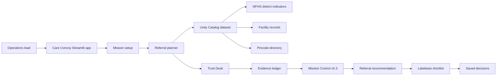

# Care Convoy

Care Convoy is a Databricks Apps submission for the Virtue Foundation Data for Good hackathon. It helps a Virtue Foundation operations lead decide where to send the next specialty medical team in India by combining district health need, facility capability, cited evidence, uncertainty labels, and a v5.3 Mission Control gate board before a plan is saved.

## Judge Summary

- **Track:** Track 3, Referral Copilot with a trust-scoring support layer.
- **Primary user:** Virtue Foundation operations lead.
- **Decision improved:** Choose a credible district and facility anchor for the next referral or outreach team.
- **Core idea:** Do not just rank facilities; decide whether the evidence is strong enough to act on.
- **Platform:** Databricks Apps, Unity Catalog, SQL Warehouse, Lakebase, Model Serving, Streamlit, pandas, Plotly, and PyDeck.

## Demo Screenshot

## How To Use It

1. Choose a care need such as maternal health, surgery, emergency care, or general access.
2. Optionally focus the run by state, district, and minimum certainty.
3. Click **Build Referral Plan**.
4. Review the top district, map, referral anchor, confidence, warnings, and cited evidence.
5. Open **Mission Control** to see the pass, review, or block gate across need, supply density, facility fit, trust, evidence, strategy, and supervisor review.
6. Open **Trust Evidence** to inspect duplicate resolution, website verification, source URLs, and weak-evidence flags.
7. Save a shortlist decision with a verification note so the recommendation becomes persistent operational state.

## What Judges Should Look For

- **Clear user workflow:** The app starts with a concrete operational question: where should the next specialty team go?
- **Provided data in the decision:** Facility records drive anchor selection, NFHS district indicators support need context, and pincode data supports district-density reconciliation.
- **Evidence-first outputs:** Facility claims, rankings, trust labels, and recommendations are paired with citation rows or visible warning states.
- **Uncertainty as product behavior:** Missing source URLs, duplicate ambiguity, weak website verification, and weak density joins reduce confidence instead of being hidden.
- **Persistent action:** Shortlist decisions are saved to Lakebase with the mission packet, gate trace, confidence, facility name, and review metadata.
- **Databricks-native execution:** The live app uses managed Databricks resources rather than a local-only prototype.

## Key Features

- **Referral planning:** Ranks districts and candidate facility anchors for the selected care need.
- **NFHS-backed district context:** Uses district health indicators alongside facility-density context to explain why a place should be reviewed.
- **Trust Desk:** Resolves duplicate-looking facility rows, checks public website evidence, and calculates trust-supported recommendation signals.
- **Mission Control v5.3:** Separates the decision into need, supply density, facility fit, trust verification, citation safety, mission strategy, and supervisor approval.
- **Evidence ledger:** Shows source-backed facility text behind important claims and keeps missing citations visible.
- **Shortlist persistence:** Saves operational decisions and reloads them from Lakebase.

## Data And Evidence

Care Convoy uses the provided Virtue Foundation dataset:

- `facilities` for facility names, capabilities, locations, source URLs, social proof proxies, doctors, capacity, and descriptive evidence.
- `nfhs_5_district_health_indicators` for district-level need signals such as child underweight rate, insurance coverage, institutional births, and high blood pressure prevalence.
- `india_post_pincode_directory` for district and state reconciliation when estimating facility-density context.

The app treats this data as valuable but imperfect. Weak joins, sparse capability text, missing URLs, stale pages, and duplicate-looking facility records are surfaced as review risks.

## Mission Control

The v5.3 Mission Control gate board helps keep the recommendation from becoming a single opaque score:

- **Need Scout** checks district need and uncertainty.
- **Supply Mapper** checks facility-density pressure for the district context.
- **Facility Scout** checks whether the lead facility appears operationally relevant.
- **Trust Verifier** reviews duplicate resolution, website status, and trust score.
- **Evidence Auditor** downgrades unsupported or uncited claims.
- **Mission Strategist** combines need, supply, capability, trust, and evidence into an action recommendation.
- **Supervisor** produces the final board verdict and confidence used in the saved shortlist.

The mission packet also carries the v5.3 population-denominator data contract, but population context is explicitly marked as planned and inactive until a source and join coverage are validated.

## Architecture At A Glance

## Validation Status

- Local deterministic tests pass: `41 passed`.
- Python syntax compilation passes.
- Local Streamlit health check passes at `/_stcore/health`.
- Dependency audit returned no known vulnerabilities.
- The v5.3 Databricks App is deployed and `RUNNING`.
- Authenticated hosted UI validation saved a shortlist item and a Lakebase readback confirmed the saved decision reloaded.
- Native MLflow GenAI evaluation ran with dataset `workspace.default.care_convoy_eval_v5_3`, two registered scorers, and 5/5 `yes` results for evidence grounding and operator actionability.
- Lakebase read-after-write confirmed shortlist metadata can persist and reload.
- Live Databricks data checks confirmed all three provided tables are populated, and the current code path returns live NFHS plus Maharashtra facility-density rows without falling back.

## V5.3 Scope

Mission Control is now implemented as a visible pass/review/block gate board. Version 5.3 adds deterministic facility candidate-window ordering, lead-anchor citation gating, NFHS/density provenance rows, lead-entity trust-review alignment, and optional MLflow tracing hooks. The optional population reference remains planned, not active, so the provided Virtue Foundation tables remain the primary decision source.

## Version History

- `v2.0` - Added Trust Desk with facility cleaning, entity resolution, website verification, and trust-supported referral planning.
- `v2.1` - Added the stage-based UI, canonical entity ranking improvements, KPI fixes, and safer missing-website handling.
- `v2.2` - Reframed the app as a referral copilot and fixed live-app layout clipping around post-run output.
- `v3.0` - Added the Convoy Review Board with separate gates for need, facility fit, trust, evidence, strategy, and supervisor review.
- `v4.0` - Verified the live Databricks App path and hardened the provided-dataset reads for NFHS and facility-density context.
- `v5.0` - Planned the multi-agent referral flow with a team-of-agents pattern.
- `v5.1` - Rebuilt the Streamlit app around the updated demo skills and deployed the Mission Control experience.
- `v5.2` - Added short-copy design guidance, bullet-led content, visible pass/review/block mission packets, and v5.2 deployment validation.
- `v5.3` - Fixed release-eval blockers around facility ranking, lead citations, district provenance, trust alignment, MLflow tracing, hosted readback, and native MLflow evaluation.

## Demo Payoff

Care Convoy does not just map need or list hospitals. It turns messy facility and district evidence into a cautious, cited, saveable referral decision for an operations lead.
