# Care Convoy

Care Convoy is a decision-support app for global-health referral planning in India. It helps an operations team compare district health need, local facility supply, facility trust signals, and source evidence before deciding where a specialty medical team should go next.

Instead of presenting a single opaque score, Care Convoy produces a saveable referral mission packet with cited evidence, uncertainty labels, duplicate and website trust checks, and a clear next action: shortlist, verify first, or hold.

The v7 app keeps the v6 operator-first layout and adds a feedback-cache pipeline for speed: deterministic facility scoring is stored in a separate derived dataset, entity mappings are appended by source fingerprint, and new facility records reuse exact or similar mappings before any new mapping row is added. A separate **For Judges** page gives a one-click backend and validation walkthrough without crowding the operator workflow.

**Hackathon note:** Care Convoy was built for the Databricks Data for Good Hackathon using the provided Virtue Foundation facility dataset, NFHS district indicators, and India pincode directory.

- **Author:** Pingying Chen
- **Co-author:** Zihang Liang

## Fast Read

From here, the README is judge-facing: it maps the project to the hackathon track, demo path, evidence model, validation proof, and Databricks resources.

**Track 3: Referral Copilot for the Virtue Foundation Data for Good Hackathon**

| Judging criterion | What Care Convoy proves | Where to look in the demo |
|---|---|---|
| Product judgment | A non-technical operations lead can choose a district, referral anchor, and verification action in minutes. | Plan, Why This Place, Save Decision |
| Evidence and uncertainty | Rankings, facility fit, NFHS context, trust labels, and recommendations show citations or warnings instead of hiding weak evidence. | Evidence Check, Compare Anchors, Why This Place |
| Technical execution | Runs as a Databricks App using Unity Catalog, SQL Warehouse, append-only scoring and entity-mapping tables, Lakebase, Model Serving hooks, MLflow evaluation, Streamlit, pandas, Plotly, and PyDeck. | For Judges, Architecture, Validation |
| Ambition | The app does not stop at a map or a list. It uses seven decision gates to decide whether to shortlist, verify first, or hold. | Decision gates |

**Best judge takeaway:** Care Convoy turns messy healthcare facility data into an evidence-backed, uncertainty-aware, persistent referral decision.

## Demo Media

<table>
  <tr>
    <td width="58%">
      
    </td>
    <td width="42%">
      <h3>3-minute video placeholder</h3>
      
<strong>Status:</strong> add the final Devpost, YouTube, or Loom link here before submission.

      <ul>
        <li>0:00 - name Track 3 Referral Copilot.</li>
        <li>0:20 - show the recommended next move.</li>
        <li>1:10 - open Why This Place for the weakest gate.</li>
        <li>1:45 - open Evidence Check for citations and uncertainty.</li>
        <li>2:20 - save the shortlist decision.</li>
        <li>2:45 - open For Judges for Databricks resources and validation.</li>
      </ul>
    </td>
  </tr>
</table>

## One Decision, End To End

1. Select a care mission such as maternal health, surgery, emergency care, or general access.
2. Filter by state, district, and minimum certainty when the operator wants a narrower run.
3. Click **Build Referral Plan**.
4. Review the priority district, map, referral anchor, backup anchor, confidence, warnings, and cited evidence.
5. Open **Why This Place** to see pass, review, or block gates for need, supply density, facility fit, trust, evidence, strategy, and supervisor action.
6. Open **Evidence Check** to inspect duplicate resolution, website verification, source URLs, and weak-evidence flags.
7. Save a shortlist decision with a verification note so the recommendation becomes durable operational state.
8. Open **For Judges** to review the app-led pitch path, backend architecture, evidence surfaces, validation status, and explicit non-claims.

<strong>Interactive judge walkthrough</strong>

| Beat | Question the judge can ask | What the app shows |
|---|---|---|
| Decide | "Where should the next team go?" | A ranked district and lead referral anchor, not a raw table. |
| Trust | "Can I believe this facility claim?" | Citation rows, website status, duplicate risk, source URL gaps, and confidence labels. |
| Act | "What should the operator do next?" | Shortlist, verify-first, or hold action from the gate trace, then a Lakebase-saved decision. |
| Prove | "What did you build on Databricks?" | The For Judges page shows the architecture, evidence model, validation summary, and scoped non-claims. |

## What Care Convoy Helps You Do

- **Find a practical starting point:** rank districts and candidate referral anchors for the selected care need.
- **Balance need with supply:** combine NFHS district health indicators with facility-density context instead of looking only at hospital counts.
- **Check whether an anchor is believable:** compare facility claims, website evidence, duplicate risk, and trust signals before acting.
- **See the evidence behind the recommendation:** inspect facility text, source URLs, and Unity Catalog provenance rows for important claims.
- **Know when to slow down:** use decision gates to turn weak evidence into a visible shortlist, verify-first, or hold action.
- **Reuse cached scoring and identities:** rely on append-only scoring and entity-mapping tables keyed by source-row fingerprints, while falling back to runtime scoring/resolution when data changes.
- **Keep the decision durable:** save the mission packet, gate trace, facility anchor, confidence, decision, and review note to Lakebase.
- **Validate the workflow:** use MLflow evaluation checks for evidence grounding and operator actionability.

## Backend Pipeline

In the live app, this backend story lives behind **For Judges** so the operator home can stay focused on the referral decision.

```mermaid
flowchart LR
    user["Operations lead"] --> ui["Streamlit mission setup"]

    subgraph data["1. Data Readiness Module"]
        uc["Unity Catalog"]
        facilities["facilities"]
        nfhs["nfhs_5_district_health_indicators"]
        pincode["india_post_pincode_directory"]
        incoming["new or changed facility row"]
        scoring["append-only facility scoring table"]
        exact["exact mapping lookup by id + fingerprint"]
        similar["similar mapping lookup: Vector Search or search-ready text"]
        entity["append-only entity-resolution mapping table"]
        skip["use existing cache row"]
        append_score["append new score only"]
        append_entity["append new or reused mapping only"]
        uc --> facilities
        uc --> nfhs
        uc --> pincode
        facilities --> incoming
        incoming --> append_score --> scoring
        incoming --> exact
        exact -->|match| skip --> entity
        exact -->|miss| similar
        similar -->|similar found| append_entity
        similar -->|no similar mapping| append_entity
        append_entity --> entity
    end

    subgraph planning["2. Need And Supply Module"]
        need["NFHS need signal"]
        density["facility-density context"]
        district["priority district"]
        nfhs --> need
        facilities --> density
        pincode --> density
        need --> district
        density --> district
    end

    subgraph trust["3. Trust And Evidence Module"]
        anchors["lead and backup anchors"]
        verifier["Trust Desk"]
        citations["Evidence Ledger"]
        scoring --> anchors
        entity --> anchors
        district --> anchors
        anchors --> verifier
        anchors --> citations
        verifier --> citations
    end

    subgraph control["4. Mission Control Module"]
        gates["seven pass-review-block gates"]
        packet["mission packet"]
        eval["MLflow evaluation"]
        save["Lakebase shortlist"]
        citations --> gates
        gates --> packet
        packet --> eval
        packet --> save
    end

    ui --> data
    data --> planning
    planning --> trust
    trust --> control
```

<strong>Module 1 - Data Readiness</strong>

- Reads the three provided Virtue Foundation Unity Catalog tables.
- Treats sparse capability fields, duplicate-looking facilities, weak source URLs, and district-name mismatch as product risks.
- Keeps scoring and entity-resolution caches as optimization paths, with source-row fingerprints to avoid stale mappings after dataset updates.
- Appends only new scoring rows and new or reused entity-mapping rows; exact cache hits are skipped.
- Stores search-ready entity text so the similarity lookup can move to Databricks Vector Search without changing the app contract.

<strong>Module 2 - Need And Supply</strong>

- Combines NFHS district health indicators with facility-density context.
- Uses mission type to choose the relevant need and capability signals.
- Outputs the priority district and uncertainty labels before selecting an anchor.

<strong>Module 3 - Trust And Evidence</strong>

- Ranks lead and backup facility anchors from the provided facilities table, preferring cached deterministic scores when their fingerprints match.
- Aligns the Trust Desk review to the selected lead facility, not an unrelated duplicate.
- Emits citation rows for facility claims and provenance rows for NFHS and density claims.

<strong>Module 4 - Mission Control And Persistence</strong>

- Runs Need Scout, Supply Mapper, Facility Scout, Trust Verifier, Evidence Auditor, Mission Strategist, and Supervisor.
- Converts the weakest required gate into the operator-facing action: shortlist, verify first, or hold.
- Saves the accepted decision and gate trace to Lakebase so the app demonstrates persistent action.

## Data Citations

Care Convoy uses the provided Virtue Foundation dataset as the primary product data source. The first three tables below are part of the Databricks hackathon dataset path `databricks_virtue_foundation_dataset_dais_2026.virtue_foundation_dataset`; the remaining rows are derived or evaluation artifacts that support the flow without replacing the provided data.

| Dataset | Role in the flow | User-facing evidence |
|---|---|---|
| `facilities` | Facility names, capabilities, locations, source URLs, social proof proxies, doctors, capacity, descriptions, anchor ranking, and Trust Desk review. | Facility citations, source URL warnings, trust labels, anchor cards. |
| `nfhs_5_district_health_indicators` | District-level health need signals such as child underweight rate, insurance coverage, institutional births, and high blood pressure prevalence. | NFHS need summary and district provenance rows. |
| `india_post_pincode_directory` | District and state reconciliation for facility-density context. | Density provenance rows and district supply warnings. |
| `workspace.default.care_convoy_facility_scoring` | Derived append-only cache from `facilities` for deterministic score features, candidate seed score, evidence counts, trust proxies, and source-row fingerprints. It is an optimization path, not a new source of truth. | Faster candidate ordering and cached score readout, with runtime scoring fallback when a fingerprint is missing. |
| `workspace.default.care_convoy_facility_entity_index` | Derived append-only mapping from `facilities` for entity resolution, canonical facility names, duplicate flags, source-row fingerprints, and search-ready text. It is an optimization path, not a new source of truth. | Faster Trust Desk resolution, exact-hit skip, similar-mapping reuse, stale-cache fallback, duplicate-risk alignment, and vector-search-ready evidence text. |
| MLflow GenAI evaluation dataset | Validation-only evaluation artifact. It is not used to make product recommendations. | Evidence-grounding and operator-actionability evaluation report. |

No external population denominator, travel-time routing dataset, Spark Declarative Pipeline, or active vector-search corpus is claimed as active in the judged workflow. The entity mapping table stores search-ready text so Vector Search can replace the local similarity lookup when configured later.

## Backend Decision Design

The backend is designed as a staged evidence pipeline rather than a single ranking formula. Each stage adds a specific check, then the final stage converts the weakest required signal into the user-facing action.

| Backend stage | What it checks | Output |
|---|---|---|
| Need signal | NFHS district indicators and demand uncertainty. | A priority district with health-need context. |
| Supply context | Facility-density pressure and pincode/district reconciliation. | A warning when local supply evidence is thin or ambiguous. |
| Scoring cache | Deterministic facility score features keyed by source-row fingerprint. | Fast candidate ordering with runtime fallback for uncached rows. |
| Anchor selection | Lead and backup facility fit from the provided facilities table. | Candidate referral anchors for the chosen care need. |
| Trust review | Duplicate resolution, website status, and facility trust signals. | Confidence labels and review-required flags. |
| Evidence audit | Lead-anchor citations and unsupported-claim downgrades. | Source-backed evidence rows and visible gaps. |
| Action strategy | Need, supply, capability, trust, and evidence trade-offs. | Shortlist, verify-first, or hold guidance. |
| Persistence | Saved mission packet, gate trace, facility anchor, confidence, decision, and note. | A durable Lakebase shortlist record. |

## Validation Status

- Databricks App is `RUNNING`.
- V7 Databricks App deployment `01f169ac51ad1c85bdc3dbbc165edf72` succeeded and Streamlit started from `src/app.py`.
- V7 deployed snapshot includes `SCORING_TABLE=workspace.default.care_convoy_facility_scoring`, `v7 feedback-cache view`, cache-source readouts, and the append-only scoring pipeline.
- V7 local app validation renders the operator home and `For Judges` page with the feedback-cache proof room copy.
- Final authenticated hosted replay is still pending before calling the app demo-ready after v7 changes.
- Earlier hosted UI validation saved a shortlist item and Lakebase readback confirmed the saved decision reloaded.
- Local deterministic tests passed after the v7 feedback-cache slice: `58 passed`.
- Python syntax compilation passed.
- Dependency audit returned no known vulnerabilities.
- Live Databricks checks confirmed all three provided tables are populated.
- Current code path returns live NFHS plus Maharashtra facility-density rows without falling back.
- V7 scoring cache is published to `workspace.default.care_convoy_facility_scoring` with `9,989` rows, `9,989` distinct facility IDs, and `9,989` distinct source-row fingerprints; a repeat dry-run skipped all `20` sampled rows.
- V7 entity mapping contract keeps `src.pipelines.entity_index` append-only by default; a live dry-run against the existing entity table skipped all `20` sampled exact rows and appended `0` rows.
- A live candidate-window proof for Maharashtra surgery joined cached scoring for `160/160` candidate rows and cached entity mappings for `160/160` candidate rows, returning `scoring_source=cached`, `entity_index_source=cached`, and `12` review rows.
- Cached entity-index table `workspace.default.care_convoy_facility_entity_index` contains `9,989` fingerprinted rows, `9,989` distinct facility IDs, and `9,960` resolved entities.
- Live helper proof returned `district_source=live`, `facility_source=live`, `entity_index_source=cached`, `12` facility rows, `12` entities, and `6` lead-anchor citation rows.
- Lakebase readback confirmed the cached entity-index proof after the helper run.
- Databricks App is running with the latest v7 feedback-cache configuration.
- Native MLflow GenAI evaluation ran with two registered checks and 5/5 `yes` results for evidence grounding and operator actionability.

## Databricks Resources

- **App:** Databricks Apps with Streamlit.
- **Governed data:** Unity Catalog tables from the provided Virtue Foundation dataset.
- **Query path:** Databricks SQL Warehouse.
- **Derived speed caches:** Append-only facility scoring table and entity-resolution mapping table keyed by source-row fingerprints.
- **Persistence:** Lakebase shortlist store.
- **LLM path:** Databricks Model Serving endpoint when configured, deterministic fallback when unavailable.
- **Observability:** MLflow tracing hooks and GenAI evaluation.

## Acknowledgements

Care Convoy was built during the hackathon period with original application code. See `AGENTS.md` for local development workflow and agent/skill reference details.

## Demo Payoff

Care Convoy does not just map need or list hospitals. It turns imperfect facility and district evidence into a cautious, cited, saveable referral decision for an operations lead.
