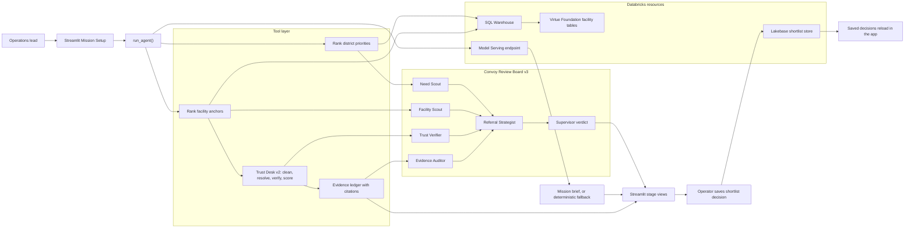

# Care Convoy

Care Convoy is a Databricks Apps MVP for the Virtue Foundation hackathon. The app helps an operations lead decide where to send the next specialty medical team in India using evidence-backed facility data, district need signals, visible uncertainty, a multi-agent Convoy Review Board v3 workflow, and a persistent shortlist workflow.

## Runtime Notes

- Live analytical reads come from the Virtue Foundation Unity Catalog tables configured in the Databricks workspace.
- Persistent shortlist state uses Lakebase at `projects/your-lakebase-project/branches/production/endpoints/primary`.
- Use [.env.example](.env.example) as the tracked reference for local Databricks and Lakebase wiring.
- The Databricks App service principal also needs Unity Catalog grants for live reads:
  - `USE CATALOG` on `databricks_virtue_foundation_dataset_dais_2026`
  - `USE SCHEMA` on `databricks_virtue_foundation_dataset_dais_2026.virtue_foundation_dataset`
  - `SELECT` on `facilities`, `nfhs_5_district_health_indicators`, and `india_post_pincode_directory`
- Grant those privileges to the app application ID / service principal identifier, not just the display name, if Unity Catalog does not recognize the display name.

## Native Databricks Deployment

- The repo now includes a Databricks Asset Bundle in [databricks.yml](databricks.yml) and [resources/care_convoy_app.app.yml](resources/care_convoy_app.app.yml).
- The app resource declares native dependencies on Lakebase, the SQL warehouse, and the serving endpoint.
- The existing `care-convoy` app is now bound to the bundle resource `care_convoy_app`.
- [app.yaml](app.yaml) lets Databricks Apps provide the Streamlit serving port; do not hard-code `8080`, because the browser availability gate catches the resulting proxy failure.
- Preferred deploy flow:
  1. `databricks bundle validate --strict --profile "databricks-profile"`
  2. `DATABRICKS_AUTH_VALUE="$(databricks auth token --profile "databricks-profile" | python3 -c 'import json,sys; print(json.load(sys.stdin)["access_token"])')" DATABRICKS_TF_EXEC_PATH=terraform databricks bundle deploy -t dev --profile "databricks-profile"`
  3. `DATABRICKS_AUTH_VALUE="$(databricks auth token --profile "databricks-profile" | python3 -c 'import json,sys; print(json.load(sys.stdin)["access_token"])')" DATABRICKS_TF_EXEC_PATH=terraform databricks bundle run care_convoy_app -t dev --profile "databricks-profile"`
  4. `databricks apps get care-convoy --profile "databricks-profile"`
  5. verify app ACLs and Unity Catalog grants if the app is healthy but still unavailable

Current deployed app URL:

- [care-convoy](https://your-databricks-app-url)
- Latest verified deployment: `<deployment-id>`, `RUNNING` and `ACTIVE` on 2026-06-15.

## Pipeline Orchestration

## Version History

- `v2.0` - Added the Trust Desk v2 workflow with facility cleaning, entity resolution, public-website verification, and trust-supported referral planning. Reference commit: `538cf01`.
- `v2.1` - Introduced the redesigned stage-based UI, canonical entity ranking improvements, KPI fixes, and safer trust-review handling for missing website signals. Reference commits: `6581107`, `88ec866`, `39a0932`, `738903d`.
- `v2.2` - Reframed the app as a referral copilot with trust-backed stage views and fixed the clipped results layout that could hide post-run output in the live app. Reference commits: `a84c278`, `988e99d`.
- `v3.0` - Added Convoy Review Board v3, a six-agent decision layer that reviews district need, facility fit, Trust Desk v2 evidence, citation safety, and supervisor approval before shortlist persistence.
- `v3.1` - Hardened the v3 validation loop with parameterized SQL filters, guarded public-page scraping, Lakebase metadata readback, model-summary provenance, app boot coverage, and a clean dependency audit.

## Native Design Baseline

- [.streamlit/config.toml](.streamlit/config.toml) sets the native Streamlit light theme used by the deployed app.
- [theme.config.toml](theme.config.toml) is the first design token source-of-truth for the fuller styling pass.

## What belongs in this repo

- Project source code
- Databricks app configuration
- Tests for project behavior
- README and other user-facing project docs

## Trust Desk v2

- Candidate facilities are cleaned and normalized before trust scoring.
- Near-duplicate rows are resolved into canonical facility entities using deterministic matching on name, city, state, domain, and coordinate hints.
- Facility trust combines dataset social signals with website corroboration from either dataset URLs or a public-search fallback.
- The app surfaces website verification status and review-required cases instead of presenting all trust scores as equally certain.

## Convoy Review Board v3

- `Need Scout` checks the district need and uncertainty context.
- `Facility Scout` evaluates the lead facility's capability fit and referral readiness.
- `Trust Verifier` reuses Trust Desk v2 entity resolution, website verification, and trust scoring.
- `Evidence Auditor` blocks claim-safe language when citations are missing or source URLs are blank.
- `Referral Strategist` combines need, capability, trust, and evidence into a recommended action state.
- `Supervisor` produces the final board verdict and stores board summary, verdict, confidence, and agent names in shortlist metadata.

Latest smoke test:

- Local deterministic tests: `python3 -m pytest tests/ -q` returned `27 passed`.
- Syntax gate: `python3 -m compileall src` passed.
- Dependency audit: `python3 -m pip_audit -r requirements.txt` returned `No known vulnerabilities found`.
- Live agent smoke returned all six board agents with supervisor verdict `shortlist after review`, confidence `Moderate Confidence`, and `tradeoff_chart_built=True`.
- Browser availability check loaded the public Databricks App URL and rendered the Care Convoy Streamlit UI instead of `App Not Available` or `502 Bad Gateway`.
- Lakebase read-after-write smoke through the app persistence layer returned a v3 validation shortlist row with board verdict, board confidence, facility name, and agent metadata.
- Remaining human gate: complete an authenticated hosted-app click-through for Review Board, Trust Evidence, shortlist save, refresh, and readback before making final demo-ready claims.

## What stays local-only

The following are intentionally ignored so the repo stays focused on the actual submission build:

- Assistant overlay: `.agents/`, `.codex/`, `AGENTS.md`, `templates/`, and local helper scripts
- Planning inputs: `ref/`, `SPEC.md`, `PLAN.md`, `DEVELOPMENT-LOOP.md`, `DESIGN-CONFORMANCE.md`, and `TESTING.md`
- Local review artifacts after MVP work: `review/`, `recordings/`, `captures/`, `exports/`, `screenshots/`, and `tmp/`
- Secrets and local machine state: `.env`, `.databricks/`, IDE files, caches, and generated media

## Post-MVP Local Check List

After the MVP is built, review these local-only artifacts before deciding what should become product code or public documentation:

- `review/` for implementation notes and manual QA findings
- `screenshots/`, `captures/`, and `recordings/` for demo and UI checks
- `exports/` for any local data extracts or one-off analysis outputs
- `tmp/` for scratch outputs that should not enter version control
